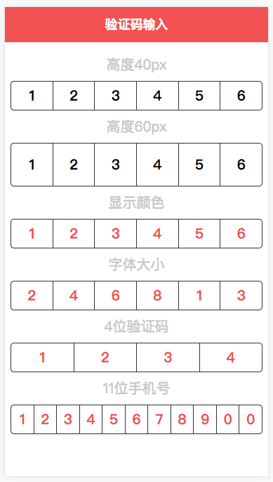

# vue-input-code

## 基于Vue2.0+的移动端验证码输入组件.



## 功能预览

+ 输入时回调
+ 结果回调
+ 自定义错误处理
+ 自定义验证码个数
+ 样式可控

[这里是可爱的Demo](https://quietboys.github.io/vue-input-code/)

## 支持

支持 Vue.js 2.0+.

## 安装和使用

```javascript
npm install vue-input-code --save
```

- 作为全局组件使用

```javascript
//在项目入口文件
import Vue from 'vue';
import VueInputCode from 'vue-input-code';
Vue.component('VueInputCode', VueInputCode)
```

- 作为局部组件

```javascript
//在某个组件中
import VueInputCode from 'vue-input-code'
export default {
  components: {
    VueInputCode
  }
}
```

HTML中使用:

```html
<vue-input-code span-size="20px" type="number" :number="5" height="50px" span-color="#f35252" input-color="#3498db" input-size="24px" :code="code" :getinput="getInput" :success="success"></vue-input-code>

<!-- 请在引用vue之后引用组件VueInputCode -->
<script src="/you/local/file/path/vue.min.js"></script>
<script src="/you/local/file/path/VueInputCode.min.js"></script> 
```

## API

| 参数    | 类型    | 说明   |  可选值 | 默认值 |
| ------------- |-------| -----| ----| -------|
| code | 数组 | 用户输入的验证码数组 | — | — |
| type | 字符串 | 用户输入类型 | number,text | number |
| upper-case | Boolean | 类型为text的时候可调整输入的字符串为大写 | true,false | false |
| get-input | 函数 | 用户每次输入后的回调函数,接受一个验证码字符串 | — | — |
| success | 函数 | 用户输入完成后的回调函数,接受一个验证码字符串 | — | — |
| error | 函数 | 用户输入不是预期的值的回调函数,接收一个错误的值 | — | — |
| customValidate | 函数 | 自定义判断用户输入值是否正确,判断输入错误则需返回`false`,正确则返回`true`| — | — |
| span-size | 字符串 | 输入后的字体显示大小 | — | 20px |
| span-color | 字符串 | 输入后的字体显示颜色 | — | #f35252 |
| input-size | 字符串 | 输入框的字体显示大小 | — | 20px |
| input-color | 字符串 | 输入框的字体显示颜色 | — | #000 |
| number | 数字 | 验证码个数 | — | 6 |
| height | 字符串 | 整个框的显示高度 | — | 60px |

## CHANGELOG

- version 1.3.1: fixed [issuse](https://github.com/zhouyuexie/vue-input-code/issues/4) about chinese input method bug.
- version 1.5.0: add customValidate
